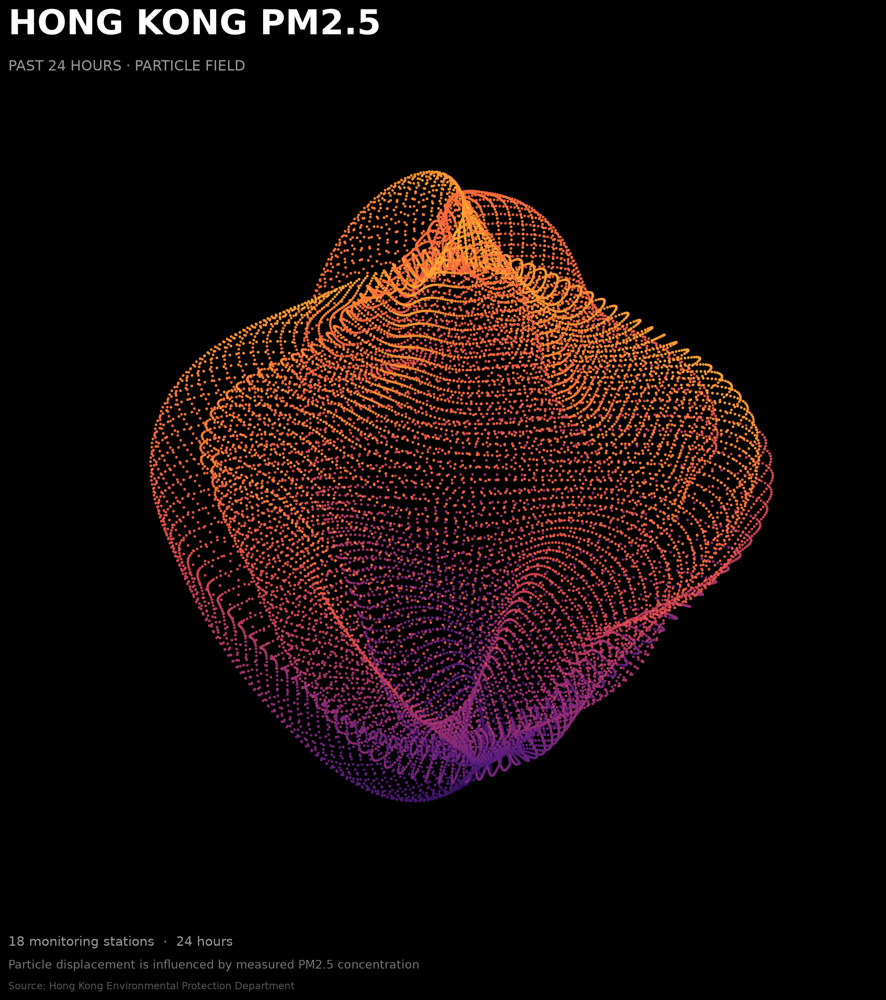
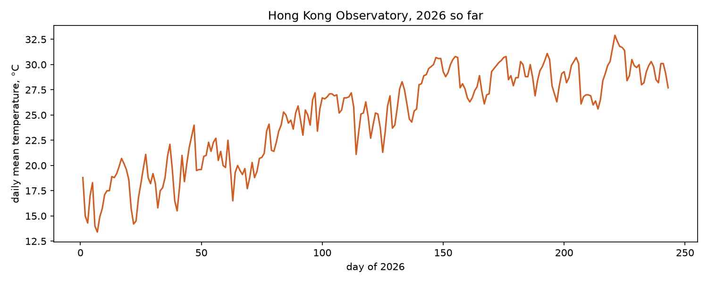
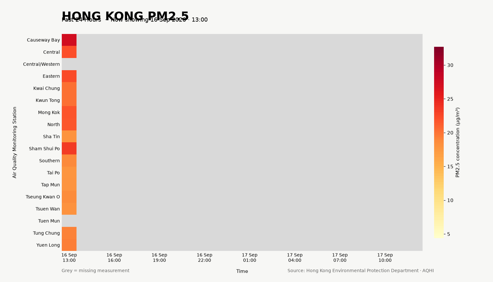

# Hong Kong PM2.5 — Past 24 Hours

## Particle Field



### Interactive Particle Field

The particle field transforms 24 hours of PM2.5 measurements from 18 Hong Kong air-quality monitoring stations into a dynamic, interactive form.

Each particle band represents a monitoring station. PM2.5 concentration affects the deformation of the particle field and is also mapped to colour, moving from purple for lower values through pink and orange to yellow for higher values within this dataset.

As the timeline moves through the 24-hour period, the field changes according to the measurements recorded at each hour.

Click a particle to inspect its monitoring station, PM2.5 value, and time. Use the timeline or Play/Pause button to explore how the field changes over time.

[Open the interactive particle field →](https://yanyan-hub57.github.io/hong-kong-air-quality/site/)

The particle field is an abstract visual representation of measured data. It does not represent the geographic position of the monitoring stations or the physical shape and movement of individual PM2.5 particles.

## Data Overview



The heatmap provides a more direct view of the original measurements. Each row represents a monitoring station, each column represents an hour, and each cell represents one PM2.5 measurement.

The heatmap acts as a reference for understanding the more experimental particle-field transformation.

### Animated Visualization



The animation reveals the hourly measurements progressively, providing another way to observe change through time.

## The phenomenon

This project explores how PM2.5 air pollution changes across Hong Kong over a 24-hour period. PM2.5 is fine particulate matter in the air.

I wanted to compare measurements from different monitoring stations and ask: how does PM2.5 concentration vary across Hong Kong and across different hours of the day?

I chose this phenomenon because air pollution is normally invisible. Turning measured concentrations into visual form makes differences across time and monitoring stations easier to explore.

## The source

The data comes from the Hong Kong Environmental Protection Department's Air Quality Health Index (AQHI) service:

https://www.aqhi.gov.hk/en/download/past-24-hours-pollutant-concentration.html

The raw XML file is downloaded by `fetch.py` and stored as `data/hong-kong-air-quality-24h.xml`.

It contains hourly pollutant measurements from 18 air-quality monitoring stations. For this project, I use three fields: monitoring station, date and time, and PM2.5 concentration. PM2.5 is measured in µg/m³.

Most stations contain 24 valid PM2.5 measurements in this downloaded dataset, while some measurements are missing. Tuen Mun has no valid PM2.5 measurements in this particular 24-hour dataset.

Missing measurements are kept as missing rather than estimated or replaced with invented values.

## How the data becomes the visualization

The project uses the same measured dataset in several visual forms.

In the heatmap, time becomes horizontal position, monitoring station becomes vertical position, and PM2.5 concentration becomes colour intensity. Yellow represents lower concentrations, while orange and red represent higher concentrations. Grey represents missing measurements.

In the particle field, the same measurements are transformed into an abstract spatial system. Each monitoring station becomes a particle band. PM2.5 measurements influence the local deformation of the field, while colour provides an additional visual encoding of concentration.

The colour scale runs from purple for lower PM2.5 values through pink and orange to yellow for higher values within the current dataset.

Time becomes interaction: moving the timeline or pressing Play changes the field according to the measurements recorded at each hour.

This means the visualization follows the transformation:

**measured PM2.5 data → station and time structure → visual mapping → particle deformation → interaction**

## What the visualization shows and hides

The heatmap makes the original station-by-time structure easy to compare. It provides a relatively direct representation of the measurements.

The particle field intentionally sacrifices some of that direct readability to explore how numerical environmental data can produce an expressive visual form.

The interactive information panel restores access to exact measurements: selecting a particle reveals its monitoring station, PM2.5 value, and time.

The visualization does not show the geographic positions of the monitoring stations. It also does not show other pollutants such as PM10, NO2, O3, or SO2.

The particle geometry should not be interpreted as the physical shape of air pollution. It is a visual mapping generated from the dataset.

## Animation and interaction

I developed three complementary representations of the same dataset.

`plot.py` creates the static heatmap, which provides an overview of the original measurements.

`animate.py` creates an animated heatmap that reveals the measurements through time.

`interactive.py` creates the interactive particle field. The viewer can select particles to inspect individual measurements and use the timeline or Play/Pause control to move through the 24-hour period.

Together, these representations move from direct data comparison toward a more experimental and interactive interpretation while remaining connected to the original measurements.

## Run it

Fetch the source data:

```bash
uv run fetch.py
```

Create the static heatmap:

```bash
uv run plot.py
```

Create the animation:

```bash
uv run animate.py
```

Create the static particle field:

```bash
uv run particle_static.py
```

Create the interactive particle field:

```bash
uv run interactive.py
```

The interactive visualization is saved as `site/index.html`.

Open it locally in a web browser, or view the published version:

[Open the interactive particle field →](https://yanyan-hub57.github.io/hong-kong-air-quality/site/)